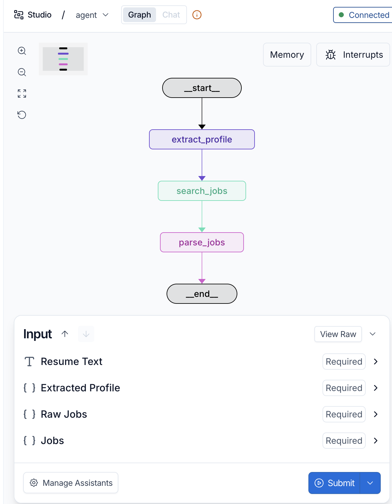

# LangGraph Based AI Agent

[](https://github.com/langchain-ai/new-langgraph-project/actions/workflows/unit-tests.yml)
[](https://github.com/langchain-ai/new-langgraph-project/actions/workflows/integration-tests.yml)

## Goal
### Purpose of this application is to help users have their first meaningful AI agent up and running on their machine, with minimal steps.

## What this AI Agent Does
### Given  a resume, it returns the list of  jobs matching that resume.

#### This AI agent takes input as the entire text of a resume, extracts important info e.g.  skill sets, experience level and the most senior roles held by the person - and returns the list of matching jobs for that resume (roles matching the most senior role occupied and the skill sets mentioned in the resume).

#### This demonstrates a real use case implemented using AI agents to demonstrates how multi-step agentic applications are implemented using [LangGraph](https://github.com/langchain-ai/langgraph), designed for showing how to get started with [LangGraph Server](https://langchain-ai.github.io/langgraph/concepts/langgraph_server/#langgraph-server) and using [LangGraph Studio](https://langchain-ai.github.io/langgraph/concepts/langgraph_studio/), a visual debugging IDE.

<div align="center">
  
</div>

####  The core logic is defined in the file `src/agent/graph.py`.

### Prerequisites
Below are the minimum requirements to run this on your local machine -

#### 1.  Docker (Install Docker on your local from - https://docs.docker.com/engine/install/ )
#### 2.  API Keys
##### We need a LLM. For simplicity, this application uses Open AI models. Signup is free, very minimal cost(token cost) is incurred when you run your application -
#### a. Signup to open AI - https://platform.openai.com/home
#### b. Create an API key at https://platform.openai.com/settings/organization/api-keys
#### c. Assign the API key value to the variable 'OPENAI_API_KEY' in the file .env i.e.
```bash
OPENAI_API_KEY=<API key created in step b).
```
#### d. To visualise the input/ouput/logs etc of the application, sign-up to Langsmith (https://smith.langchain.com/),
#### e. Create an API key in Langsmith (Go to settgins page  https://smith.langchain.com/settings  and click on API keys),
##### f. Assign the API key value to the variable 'LANGSMITH_API_KEY' in the file .env i.e.
```bash
LANGSMITH_API_KEY=<API key created in step e).
```
## Running the application

### Docker way (Simplest)
#### 1. Build Docker Image (run below command after downloading and extracting the zip code from this repo -
```bash
 docker build -t resume-to-job-agent .
```
#### Run the Docker Image
```bash
 docker run -p 2024:2024 resume-to-job-agent
```

#### Run the below command, passing-in the entire text of your resume under field 'resume_text' and  get the output (list of jobs) as list of JSON rows -
```bash
curl http://localhost:2024/runs/stream \
-X POST \
-H "Content-Type: application/json" \
-d '{
"assistant_id": "agent",
"input": {
"resume_text": "<Paste your entire resume text>>"
}
}'
```
#### Sample Output -
```bash
event: metadata
data: {"run_id":"019da6e2-5ddb-7ce3-98bb-da4fef956af7","attempt":1}

event: values
data: {"resume_text":"Senior Engineering Manager with 15 years experience..."}

event: values
data: {"resume_text":"Senior Engineering Manager with 15 years experience...","extracted_profile":{"skills":[],"roles":[],"experience_years":0,"most_senior_role":"Software Engineer"}}

event: values
data: {"resume_text":"Senior Engineering Manager with 15 years experience...","extracted_profile":{"skills":[],"roles":[],"experience_years":0,"most_senior_role":"Software Engineer"},"raw_jobs":[{"title":"Software Engineer","company":"Microsoft","location":"Hyderabad","url":"https://jobs.microsoft.com/example"},{"title":"Software Engineer - Backend","company":"Amazon","location":"Bangalore","url":"https://amazon.jobs/example"}]}

event: values
data: {"resume_text":"Senior Engineering Manager with 15 years experience...","extracted_profile":{"skills":[],"roles":[],"experience_years":0,"most_senior_role":"Software Engineer"},"raw_jobs":[{"title":"Software Engineer","company":"Microsoft","location":"Hyderabad","url":"https://jobs.microsoft.com/example"},{"title":"Software Engineer - Backend","company":"Amazon","location":"Bangalore","url":"https://amazon.jobs/example"}],"jobs":[{"summary":"Microsoft - Software Engineer (Hyderabad)","url":"https://jobs.microsoft.com/example"},{"summary":"Amazon - Software Engineer - Backend (Bangalore)","url":"https://amazon.jobs/example"}]}
```

#### You can check Langsmith UI to  check above input, outputs and intermediate steps - and much much more (refer Langsmith doc) (https://smith.langchain.com/)

### Non Docker way  (this is for developers who know how to fix dependency issues and debug startup issues)
#### 1. Install Python above version 12
#### 2. Install dependencies, along with the [LangGraph CLI](https://langchain-ai.github.io/langgraph/concepts/langgraph_cli/), which will be used to run the server.

```bash
cd path/to/your/app
pip install -e . "langgraph-cli[inmem]"
```

#### 2. Install Python dependencies
```bash
pip install --no-cache-dir -r requirements.txt
 ```
### Start the application
```bash
langgraph dev --allow-blocking
```

Above command opens the langsmith UI on your local, where you can provide the input (paste entire text from your resume doc) to the field 'resume_text', and get the output

### What is Real in this application
#### It uses a real LLM (openAI model). This LLM parses the resume text to figure out skill set, number of year of experience and the most senior role held by the person.

### What is Not Real(mocked)) in this application
#### It does not do a real search in job portals with the criteria details received from LLM call (skill sets, years of experience, target job designation) - that is left for you to implement.

You can extend this graph to orchestrate more complex agentic workflows that can be visualized and debugged in LangGraph Studio.


### Minor Issues and their solution
#### Problem - Start-up failing (in non Docker way) with below error
```bash
Port 2024 is already in use. Please specify a different port or omit the port argument to auto-discover an available one.
```

#### Solution - Release the port (This command is for Mac/Linux, please check corresponding Windows command if you are using Windows)
```bash
kill -9 $(lsof -t -i:2824)
```
It should show  below response in case of success
```bash
kill: not enough arguments
```
Now start the application, it should start -
```bash
langgraph dev --allow-blocking
```
